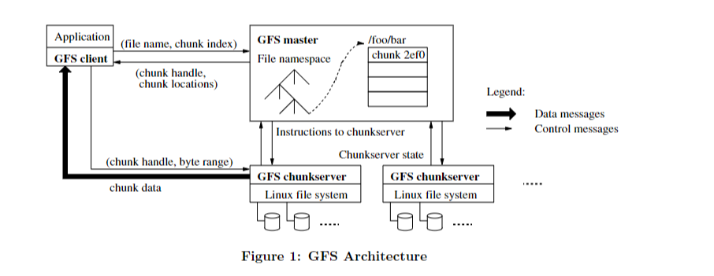
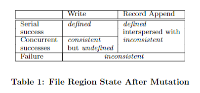
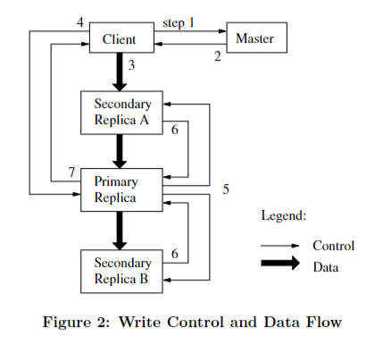
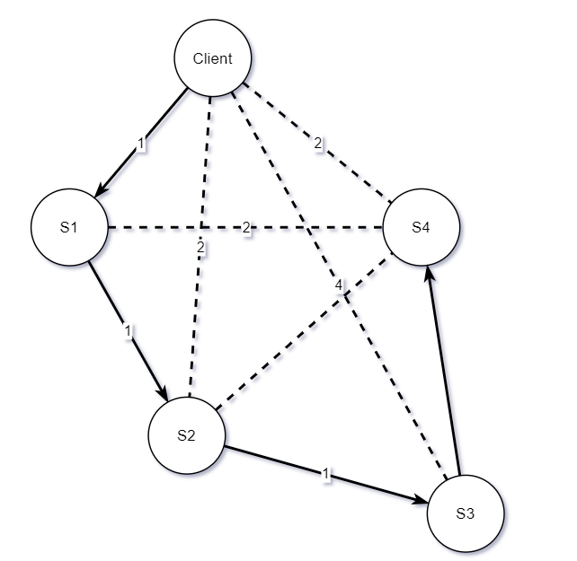

gfs

# 摘要

​	Google 文件系统（GFS）是一种由 Google 设计和实现的文件系统。它是一种可扩展的分布式文件系统，专为大型分布式数据密集型应用程序而设计。其提供容错功能，即使出现硬件故障或其他问题，可以正常运行。设计时考虑运行在廉价机器上，因此比其他类型的文件系统成本更低。GFS可以同时处理大量数据和请求。虽然 Google 文件系统的许多目标与以前的分布式文件系统相同，但其设计是由对 Google 应用程序负载和技术环境的需要推动的。GFS的设计与早期文件系统假设背道而驰，这促使人们对截然不同的设计要点进行了探索。GFS成功满足谷歌的存储需求，并在公司内部广泛部署，用于生成和处理其服务所使用的数据存储平台。GFS中最大的集群有一千多台计算机上、数千个磁盘上，提供数百 TB 的存储空间，并且可以由数百个客户端同时访问。本文介绍了旨在支持分布式应用程序的文件系统接口扩展，讨论了谷歌文件系统设计的许多方面，并报告了微基准测试和实际使用的测量结果。

# 介绍

​	Google 文件系统 (GFS) 的设计和实施旨在满足谷歌不断增长的数据处理需求。GFS 与以前的分布式文件系统有着相似的目标，例如性能、可扩展性、可靠性和可用性。但是，GFS的设计是由对Google应用负载和技术环境的需求推动的，做出了部分与早期文件系统设计假设不同的地方。

​	**常态化的组件故障**：组件故障在 GFS 中很常见，因为文件系统由数百甚至数千台存储计算机组成，这些存储计算机由廉价的商品部件构建，并且可供相当数量的客户端计算机访问。组件的数量和质量决定了某些组件在任何给定时间都无法正常工作，有些组件无法从当前的故障中恢复过来。已观察到由应用程序错误、操作系统错误、人为错误以及磁盘、内存、连接器、网络和电源故障引起的问题。通过**持续监控**、**错误检测**、**容错**和**自动恢复**以保障系统可靠性和可用性。

​	**适配大文件**：GFS 处理大小为多 GB 的大文件，与处理较小文件的传统文件系统不同。在处理包含数十亿个对象、 TB级 快速增长的数据集时，传统文件系统需要管理数十亿个大约 KB 大小的文件，显得很笨拙。由于文件很大，必须重新设计文件系统的，例如 I/O 操作和块大小，以优化性能。

​	**尾部追加**：GFS 中的大多数文件都是通过追加数据写入的，不存在随机修改。一旦写入，文件只能被读取，而且通常只能按顺序读取。鉴于这种对大文件的访问模式，追加成为性能优化和原子性保证的重点，而在客户端中缓存数据块则失去了吸引力。
​	**统一设计应用程序和文件系统 API** 以提高灵活性，从而使整个系统受益。例如，GFS 放宽一致性模型，以简化文件系统。还引入了原子追加操作，这样多个客户端就可以同时追加到一个文件中，而无需进行额外的同步。本文稍后将详细讨论这些设计选择。
目前部署了GFS集群中，最大的拥有超过 1000 个存储节点，超过 300 TB 的磁盘存储，并且由不同计算机上的数百个客户端连续大量访问。

# 设计概览

​	GFS适用于大型分布式数据密集型应用程序。 该设计由对需求驱动，与之前的文件系统不同。 该系统在廉价的商用硬件上运行时提供容错能力，并为大量客户机提供高聚合性能。 

## 假设

-   GFS 由容易出现故障的**廉价商用机**构建。因此，系统必须持续监控自身，并定期检测、容忍组件故障，并迅速从组件故障中恢复。
-   GFS 旨在存储**少量的大文件**，预计有几百万个文件，每个文件的大小通常为 100 MB 或更大。多 GB 文件是常见情况，应加以有效管理。但是，必须支持小文件，但系统无需针对它们进行优化。
-   工作负载主要由两种读取组成：**大型流式读取**和**小型随机读取**。在大型流式读取中，单个操作通常读取数百 KB，更常见的是 1 MB 或更多。来自同一个客户端的连续操作通常会读取文件的连续区域。一个小的随机读取通常在某个任意偏移量下读取几KB。注重性能的应用程序通常会对其小读取进行批处理和排序，以稳定地浏览文件，而不是来回移动。
-   工作负载还有许多**大规模的顺序写入**，这些写入操作会将数据附加到文件中。写操作大小与读操作大小相似。写入文件后，很少会再次修改文件。支持在文件中任意位置进行小写入操作，但不一定要高效。
-   GFS 需要同时处理多个客户端向一个文件追加的请求。这些文件通常用作生产者-消费者队列或用于多向合并。数百个生产者（每台计算机运行一个）将同时追加到一个文件中。 最小的同步开销意味着系统应尽可能少地使用同步来实现原子性，因为同步可能是分布式系统的性能瓶颈。系统还必须确保稍后可以读取该文件，可以由其他客户端读取 。
-   GFS 针对于数据密集型应用，需要处理大量数据，高带宽比低延迟更重要。系统需要能够快速高效地处理大量数据，而不是专注于最大限度地减少传输单个数据所花费的时间。 这与传统文件系统的假设背道而驰，后者优先考虑低延迟而不是高带宽。 通过优先考虑高带宽，GFS能够满足其目标应用程序的需求，并为大量客户提供高综合性能。

## 接口

​	GFS 提供了用户熟悉的文件系统接口，但是没有实现诸如POSIX之类的标准API，这是一组操作系统标准。GFS 中的文件按目录层次结构组织，并由路径名标识，这是在文件系统中组织文件的常用方法。GFS 支持创建、删除、打开、关闭、读取和写入文件的常规操作，这些是文件系统的基本文件操作。
​	GFS 还具有快照和记录追加操作，这是传统文件系统中都没有的独特功能。Snapshot 以低成本创建文件或目录树的副本，这对于在不影响原始文件的情况下创建备份或测试更改非常有用。Record append 允许多个客户端同时向同一个文件追加数据，同时保证每个客户端追加的原子性。这对于实现多路合并结果和生产者-消费者队列很有用，许多客户端可以同时追加到这些队列而无需加锁。这些类型的文件对于构建大型分布式应用程序非常有用，这是 GFS 的主要用途。快照和记录附录分别在第 3.4 节和第 3.3 节中进行了进一步讨论，这两节提供了有关这些功能的更多详细信息。

## 架构

​	GFS由单个主服务器和多个区块服务器组成，可被多个客户端访问。只要计算机资源允许，可在同一台计算机上同时运行区块服务器和客户端，并且接收较低的可靠性。
​	GFS 中的文件分为固定大小的块，每个区块由创建区块时主服务器分配的不可变且全局唯一的 64 位区块句柄标识。Chunkservers 将区块作为 Linux 文件存储在本地磁盘上，并读取或写入由区块句柄和字节范围指定的区块数据。为了提高可靠性，每个区块都在多个区块服务器上备份。默认情况下，GFS 存储三个副本，但用户可以为文件命名空间的不同区域指定不同的复制级别。在多个区块服务器上复制区块可确保在出现硬件故障或其他问题时数据不会丢失。使用固定大小的区块可实现高效的数据处理，并减少网络延迟对性能的影响。

​	Master 负责维护所有文件系统**元数据**，包括各种类型的信息，例如命名空间（目录树）、访问控制信息、从文件到块的映射以及块的当前位置。Master 还控制系统范围内的活动，例如**块租约管理**，其中包括将租约分配给 chunkserver，以确保它们在一定时期内对特定区块具有独占访问权限，有助于防止冲突并确保数据一致性。孤立块的**垃圾收集**是 Master 执行的另一项重要任务，它涉及识别和删除不再需要或已损坏的块。Master 也负责管理块服务器之间的**块迁移**，包括将块从一台服务器移动到另一台服务器以平衡负载并确保最佳性能。Master 与每个块服务器维持**心跳**，以发送执行并收集状态信息。这使主机能够监控系统的运行状况并根据需要进行调整，以确保其继续平稳运行。

​	GFS 客户端代码链接到每个应用程序，该应用程序实现文件系统 API，并与 Master 和 Chunkservers 通信，代表应用程序读取或写入数据。 Client 与 Master 间交互元数据变更，但真实数据都直接发送到 ChunkServers。 GFS 不提供 POSIX API，因此不需要挂接 Linux vnode 层。

​	客户端和块服务器都不会缓存文件数据。客户端缓存几乎没有什么好处，因为大多数应用程序都会流式传输大文件或工作集太大而无法缓存。 没有客户端缓存可以消除缓存一致性问题，从而简化客户端和整个系统。但客户端会缓存元数据。 ChunkServers 不需要缓存文件数据，因为块存储为本地文件，而且 Linux 的缓冲区缓存已经将经常访问的数据保存在内存中。

​	

## 单主架构

​	GFS 只有一个 Master，它简化了设计，使 Master 能够利用全局信息做出复杂的块放置和块复制决策。 单主架构可以更好地协调和管理分布式文件系统。 Master 负责维护文件命名空间并跟踪每个数据块的位置。还负责将区块分配给区块服务器，并确保每个区块都有足够的副本以实现容错。 但是，必须尽量减少主节点参与读取和写入的情况，以防止其成为瓶颈。 客户端从不通过主节点读取和写入文件数据，以避免请求过载。 取而代之的是，客户端会询问主节点他们应该联系哪些区块服务器来读取或写入数据。 客户端会限时缓存元数据，并直接与块服务器交互。 此架构允许高效、可扩展的数据访问，同时仍能保持容错和一致性。

​	通过图1来介绍简单的读流程。第一步是让客户端通过固定的块大小将应用指定的文件名和字节偏移量转换为文件内的块索引。 确定区块索引后，客户端会向 Master 发送包含文件名和块索引的请求。 然后，Master 用将块句柄和副本的位置返回客户端。 客户端使用文件名和块索引作为密钥缓存此信息，避免再与 Master 进行不必要的交互。缓存信息后，客户端向其中一个副本（通常是最接近的副本）发送请求，指定块句柄和该区块内的字节范围。 如果客户端需要再次读取相同的区块，在缓存的信息过期或文件重新打开前无需与 Master 交互。 实际上，客户端可以在同一个请求中请求多个块，而 Master 也同时返回多个块索引，这有助于减少后续客户端与 Master 的交互，而无额外开销。

## 块大小

​	块大小是GFS的核心参数。块大小设为 64 MB，比传统文件系统大得多。每个块副本都作为普通 Linux 文件存储在 chunkserver 上，并且仅在需要时进行扩展，这样可以避免因内部碎片而浪费空间。

​	大块设置有很多优势，例如减少 Client 与 Master 的交互，因为对同一个块进行读写只需要向主节点发出一次初始请求即可获取块位置信息。减少与 Master 的交互可大幅降低GFS的工作负载，因为应用程序大多是顺序读取和写入大文件。即使是小规模的随机读取，客户端也可以轻松地缓存多 TB数据集的所有块位置信息。在较大的块上，客户端很可能需要对单个块进行多次访问，可通过保持与块服务器的持续 TCP 连接来减少网络开销。较大的块大小还会减小存储在主服务器上的**元数据**的大小，从而使 GFS 元数据可存内存中而不担心内存空间，将在第 2.6.1 节中讨论。

​	即使使用延迟的空间分配，大块大小也有其缺点。一个小文件由少量块组成，可能只有一个块，如果许多客户端都在访问同一个文件，则存储这些块的块服务器可能会成为热点。实际上，热点并不是主要问题，因为应用主要按顺序读取大型多块文件。

​	当批处理队列系统首次使用 GFS 时，确实出现了热点，在这种系统中，可执行文件作为单块文件写入 GFS，然后同时在数百台计算机上启动。存储此可执行文件的几个区块服务器因数百个同步请求而过载，但是 Google 通过提高此类可执行文件的副本数量，以及打散应用的启动时间来解决此问题。
解决热点问题的可行长期解决方案是允许客户端在这种情况下从其他客户端读取数据（类似peer-to-peer）。

## 元数据

​	GFS 的 Master 存储三种类型的元数据。第一种元数据是文件和块命名空间（目录树），用于跟踪系统中的文件和区块。第二种是从文件到块的映射，用于定位构成文件的块。所有元数据都保存在 Master 中，便于快速访问和检索信息。为保障元数据的持久性，系统会在 Master 上将变更落盘并在复制到远程的操作日志中。日志提供了对 Master 状态简单可靠的更新，在 Master 宕机时不用担心一致性问题。但是，Master 不会永久存储块位置信息。在 Master 启动以及有新的块服务器加入集群时，向每个块服务器拉去块信息。这种方法允许系统动态调整群集中的变化，例如添加或删除区块服务器。总体而言，Master 在管理 GFS 元数据方面起着至关重要的作用，其设计是性能、可靠性和可扩展性之间的平衡。

### 内存数据结构

​	GFS 将元数据存储在内存中，Master 可以快速的执行命令。由于元数据都在内存中，Master 可以在快速高效地定期扫描全部状态。这种周期任务用于各种活动，例如区块垃圾收集、块服务器故障时的重新复制以及块迁移以平衡块服务器之间的负载和磁盘空间使用情况。4.3、4.4节会详细介绍这些内容。

​	纯内存方式的一个潜在问题是，块的数量以及整个系统的容量都受到 Master 内存容量的限制。但是，这在实践中并不是一个严重的限制，因为 Master 为每个 64 MB 区块保留的元数据少于 64 字节。由于顺序填充，文件的大多数块是填满的，只有最后一个可能被部分填满，所以单个大文件对应的块数量不多。通常每个文件命名空间所需的字节少于 64 字节，因为它使用前缀压缩来紧凑地存储文件名。

​	如果需要支持更大容量的文件系统，向 Master 添加额外内存的成本很小，而将元数据存储在内存中可获得的简单性、可靠性、性能和灵活性。

### 块地址

>   Master 控制着块信息的变更，无需块服务器定时上报块变更？

​	Master 不会持久化块服务器上的块信息。相反，它会在启动时轮询 chunkservers 以获取这些信息。 此后，主节点可以保持最新状态，因为它可以控制所有区块的位置，并通过常规的 HeartBeat 消息监视块服务器状态。 

​	最初，作者试图将块位置信息永久保存在 Master，但在启动时以及之后定期向块服务器请求数据要简单得多。 此设计消除了在 chunkservers 加入和离开集群、更改名称、失败、重启等时保持 Master 和块服务器同步的问题。在拥有数百台服务器的集群中，这些事件经常发生。

​	此外，块服务器在自己的磁盘上有哪些区块或没有哪些区块的最终决定权在于 chunkserver 本身。因此，在 Master 上保持对这些信息的一致视图是没有意义的，因为块服务器上的错误可能会导致块自发消失（例如，磁盘可能变坏并被禁用），或者人为重命名 chunkserver。如果 Master 要维持每个块服务器上块信息的一致视图，则需要不断检查和更新这些信息，这会效率低下而且可能不可靠。通过允许每个 chunkserver 管理自己的区块，系统可以提高容错能力和对错误的弹性。

### 操作日志

​	操作日志是 GFS 的重要组成部分，其中包含关键元数据变更的历史记录。它是元数据的唯一持久化记录，也是定义并发操作顺序的逻辑时间表。创建文件、区块及其版本的逻辑时间只由操作日志识别。

​	由于操作日志至关重要，因此必须对其进行可靠存储，并在变更持久化前，不应让客户端感知变更。如果在变更持久化前已对客户端可见，则即使块本身仍然存在，整个文件系统或最近的客户端操作也可能会丢失。为确保可靠性，将在多节点上复制操作日志，只有在本地和远程都将日志落盘后，才会响应客户端操作。Master 在刷新前将多个日志打包批处理，从而减少刷新和复制对整体系统吞吐量的影响。

​	Master 通过重播操作日志来恢复其文件系统状态。 为了最大限度地缩短启动时间，日志必须保持较小。 每当日志超过一定大小时，Master 都会检查其状态。 检查点以类似 B 树的紧凑形式创建，可以直接映射到内存中，无需额外解析即可用于命名空间查找。 这进一步加快了恢复速度并提高了可用性。

​	由于构建检查点可能需要一段时间，Master 内部状态的设计成可以在创建新的检查点时不阻塞变更。 Master 切换到新的日志文件并在单独的线程中创建新的检查点（copy 某一瞬间的快照？）。新的检查点包括切换前的所有变更，对于包含几百万个文件的集群，可以在一分钟左右的时间内创建。 完成后，新的检查点将在本地和远程写入磁盘。

​	恢复只需要最新的完整检查点和后续的日志文件。 可以自由删除较旧的检查点和日志文件，但为了防范灾难，保留了一些检查点和日志文件。 检查点操作期间出现故障不会影响正确性，因为恢复代码会检测并跳过不完整的检查点。

##  一致性模型

​	GFS 采用松一致性模型，以支持高度分布的应用，系统的设计易于使用和维护，在一致性和性能之间进行的权衡。 尽管其一致性模型比较宽松，但 GFS 仍然为应用程序提供数据准确性和时效性保障。GFS如何维持这些担保的细节留给了本文的其他部分。  

​	

### GFS提供的保障

​	文件命名空间的变更（例如文件创建）是原子的，这些变更被视为单一的、不可分割的操作，它们要么全完成，要么全不完成。 在 GFS 中，文件命名空间变更仅由 Master 处理，Master 负责维护文件系统的整体状态。 Master 使用命名空间锁确保原子性和正确，以防止多个客户端同时修改同一个文件命名空间。 此外，Master 的操作日志定义了这些操作的全局总顺序，这有助于确保所有 Client 在任何给定时间都能看到相同的系统状态。

​	数据变更后文件区域的状态取决于多种因素，包括变更的类型、成功还是失败以及是否存在并发修改。 表 1 总结了这些变更的可能结果，包括受影响区域是已定义（即一致）还是未定义（即不一致）。 定义的区域是指所有客户端将始终看到相同的数据，无论他们从哪个副本读取数据，并且如果文件数据变更一致，并且客户端将看到变更写入的全部内容，则该区域是在文件数据变更之后定义的。 并发成功的修改会使该区域未定义但保持一致，这意味着所有客户端都能看到相同的数据，但可能无法反映任何一个变更所写的内容。 变更失败会使该区域不一致且未定义，这意味着不同的 Client 可能会在不同的时间看到不同的数据。 使用 GFS 的应用可以区分已定义区域和未定义区域，但它们无需区分不同类型的未定义区域。

​	GFS有两种数据变更类型：写入和记录追加。写入操作向指定的文件偏移量写入数据。记录追加操作至少会以原子方式追加一次数据，即使存在并发修改也是如此，但偏移量由 GFS 选择。相比之下，常规的追加操作只是 Client 感知到的是在当前文件的末尾执行写入操作。返回给客户端的偏移量指向包含该记录的已定义区域的开始。GFS 可能会在定义的区域之间插入填充或重复记录项，这些区域被认为不一致，通常比用户数据小得多。

​	经过一系列成功的变更后，可以保证变更的文件区域已定义，并包含最后一次变更写入的数据。GFS 通过在所有副本上以相同顺序对区块应用变更来实现这一目标，并使用块版本号来检测任何因在 chunkserver 异常未变更的过时副本。旧的副本永远不会参与更新，位置信息也不会被 Master 返回给 Client，其会尽早被垃圾收集。

​	Client 可以在信息刷新前从旧的副本中读取数据，在缓存失效或再次打开文件时会更新副本元数据
由于 GFS 中的大多数文件都是仅追加的，因此旧副本通常会返回过早的区块结尾，而不是过时的数据。
当读者重试并联系主服务器时，它会立即获得当前的区块位置。GFS 通过主服务器和所有区块服务器之间的心跳来识别异常块服务器，并通过校验和检测数据损坏。发现问题后，数据会尽快从有效副本中恢复，只有在 GFS 做出反应之前（通常在几分钟之内）所有副本都丢失时，区块才会不可逆转地丢失。
即使在这种情况下，区块只会变得不可用而不是损坏，应用程序会收到明显的错误而不是损坏的数据。

### 应用实现

​	为了实现松一致性模型，GFS 使用了一些已经用于其他目的的简单技术。有记录追加、检查点和写入自校验功能的记录。

​	其中一种技术是在变更文件时依赖于**追加而不是覆盖**。这意味着不是覆盖现有数据，而是将新数据添加到文件末尾。 这种方法比随机写入更高效，更能抵御应用程序故障，因为随机写入可能会导致数据损坏或丢失。 

​	GFS 使用的另一种技术是**检查点**，它定期保存文件状态，以确保在出现故障时数据不会丢失。 检查点还可能包括应用程序级校验和，以确保数据的完整性。 文件读取器仅处理直到最后一个检查点的数据，该检查点已知处于已定义状态。

​	第三种技术是写入**自我验证、自我识别**的记录。 如果多个写入器同时追加到一个文件中，GFS 会使用至少追加一次的语义来保留每个写入器的输出。此操作可能会导致偶尔出现填充和重复，读者需要处理这些问题。 每条记录都包含额外的信息，例如校验和以验证其有效性。 可以使用校验和识别和丢弃多余的填充和记录片段，并使用记录中的唯一标识符过滤掉重复项。这些用于记录 I/O 的功能位于 GFS 应用程序共享的库代码中，可应用于 Google 的其他文件接口实现。

​	总体而言，这些技术允许 GFS 为大量客户端提供容错和高性能，同时适应宽松的一致性模型。

# 系统交互

​	GFS的设计，旨在最大限度地减少Master的负载，避免 Master 成为大规模分布式系统的瓶颈或单点故障。 文本继续描述 Client、Master 和 ChunkServer 间的交互，如何实现数据变更、记录的原子追加和快照。

## 租约和变更顺序

​	GFS 中，变更是指更改块内容或元数据的操作，例如写入或追加操作。每次变更都是在块的所有副本上执行的，以确保容错和数据一致性。系统使用租约保证副本之间一致的变更顺序。Master 向其中一个副本（称为主副本 primary）授予区块租约。然后，主副本为块的所有变更指定一个顺序，在更新时所有副本都遵循此顺序。因此，全局变更顺序由 Master 选择的租约授予顺序定义，在租约中由主副本分配的序列号定义。
​	租约旨在最大限度地减少 Master 的管理开销，租约本质上是 chunkserver 对数据块执行变更的限时许可。租约的初始超时时间为 60 秒，但只要区块发生变化，主副本就可以无限期地向 Master 请求延期。
延期请求和授权随着 Master 和所有 chunkserver 间的 HeartBeat 传递。有时，Master 可能会尝试在租约到期之前撤销租约，例如当 Master 想要对正在重命名的文件禁用变更时。即使 Master 与主副本间断通信终端，它也可以在旧租约到期后安全地向另一个副本授予新的租约。

​	如图 2 中描述了写入请求的控制流和数据流。 

>   步骤3中是client向所有的chunkserver推送数据，而不是client将数据推送道primary，再由primary实现多副本冗余。减少chunkserver间多余的io消耗，也简化chunkserver的代码实现。

1.   Client 向 Master 询问是哪个 chunkserver 持有当前块的租约，以及其他副本的位置。如果没有分配租约，Master 会选择一个副本授予其租约（图中未展示）。 
2.   主副本（Primary）响应 Client，消息中包含其主副本的身份认证和其他副本的位置。Client 缓存这些数据用于后续变更，只有在主副本无法访问或响应其不再持有租约时才需要再次联系 Master。
3.   Client 按将数据推送到所有副本，但不保证副本间推送的先后顺序。每个 chunkserver 将数据缓存在内部 LRU 缓冲区中，直到数据被使用或过时。 通过将数据流与控制流分离，无论哪个块服务器是主副本，系统都可以根据网络拓扑最优调度的数据流（减少不必要的数据传输），从而提高性能，3.2节会详细介绍。
4.   一旦所有副本都确认接收了数据，Client 就会向 Primary 发送包含所有副本信息的写入请求。 Primary 为来自多个 Client的变更分配连续的序列号，并按序将变更应用于自己的本地状态。通过序列号处理多端同时写入相同数据时的冲突和不一致。
5.   Primary 将写入请求转发给所有Secondary 副本。 每个辅助副本都按照主副本分配的相同序列号顺序应用变更。
6.   在 Secondary 完成变更后会 ack 主副本。 
7.   Primary 回复 Client，所有副本遇到的错误都会报告给客户端。如果出现错误，Primary 和 Secondary 可能存在部分写入成功部分写入失败（如果故障在 Primary，则其不会生成序列号并执行后续的下发操作），Client 请求会被视为失败，变更后的区域也处于不一致状态。 Client 会尝试重试 (3) 到 (7) 步来处理此类错误，如果不能修复，则重新发起完整的写入请求。

​	如果写入数据较大或跨多个块（在 GFS 中，区块是固定大小的数据单位），Client 会将其分解为多个较小的写入操作。 这些较小的写入操作与常规写入操作流程相同，但它们可能会与其他 Client 的并发操作交错而被覆盖。 虽然副本（存储在不同计算机上的文件副本）是一致的（因为所有副本上的各个操作都以相同的顺序成功完成），但共享文件区域最终可能包含来自不同 Client 的数据。 这使得该区域将处于一致但未定义的状态，如本文第 2.7 节所述。 

## 数据流

​	系统将数据流与控制流分离，以优化网络使用率。控制信号从 Client 流向 Primary，然后流向所有 Secondary，而数据则以流水线方式沿着精挑细选的线路线性推送给 ChunkServer 。 目标是充分利用每台计算机的网络带宽，避免网络瓶颈和高延迟链路，并最大限度地减少推送所有数据的延迟。

​	 为了充分利用每台计算机的网络带宽，数据是沿着 ChunkServer 线性传递的，而不是以树等其他拓扑方式传输（并行传递）。这种方法使单机使用全部出站带宽传输数据，而不是在多个接收者之间分配（避免切换、效率更高）。线性传输方法还有助于确保数据传输可靠且没有错误，因为链中的每个区块服务器都可以在将数据传递到下一台计算机之前验证数据是否已正确接收。

​	为避免网络瓶颈和链路延迟，每台计算机都将数据转发给网络拓扑中尚未收到数据的 “最近” 计算机。 例如，Client 将数据推送到 S1到 S4（S1-S4都是Secondary），它会将数据发送到最近的 S1；S1 将数据转发到 S2-S4中最近的区块服务器 S2；S2 会将数据转发到 S3 或 S4（以更接近 S2 为准），依此类推。GFS 使用的网络拓扑结构非常简单，可以根据 IP 地址准确估计 “距离”，从而更轻松地确定最近的计算机来转发数据。 

​	最后，系统通过通过 TCP 连接对数据传输进行管道化处理（节点间串行但以字节为单位流式传输），从而最大限度地减少延迟。一旦 ChunkServer 收到部分数据，它就会立即开始转发这些数据。管道传输特别有用，因为系统使用的是具有全双工链路的交换网络，并且立即发送数据不会降低接收速率。 将 B 字节传输到 R 副本的理想耗时为 B/T + RL，其中 T 是网络吞吐量，L 是在两台计算机之间传输字节的延迟。GFS 使用的网络链接通常为 100 Mbps，L 远低于 1 毫秒。因此，理想情况下，1 MB 可以在大约 80 毫秒内分布。

##  记录的原子追加

​	分布式应用程序中，经常有不同计算机上的多个 Client 同时追加到同一个文件中，GFS 为此提供了一种名为 record append 的原子追加操作。 在传统写入中，Client 指定待写入数据的偏移量。但是，对同一区域的并发写入不是串行化的，该区域数据最终可能是多个 Client 数据片段的混杂体。  而在 `record append` 中，客户端仅指定数据；由GFS 选定偏移量，将数据以原子方式（即作为一个连续的字节序列）将其追加到文件中，并将该偏移量返回给客户端。 这类似于在 Unix 中向 O_APPEND 模式下打开的文件写入数据，多个写入器同时执行此操作而没有资源竞争。

​	分布式应用程序中，不同计算机上的多个客户端大量使用 `record append` ，在同一时刻将数据追加到同一个文件中。 将数据追加到同一个文件中，传统写入需要额外复杂且昂贵的同步操作，例如通过分布式锁管理器。 但是，通过追加记录，客户端可以追加到同一个文件中，而无需进行额外同步。这是因为 record append 允许客户端在不修改任何现有数据的情况下追加到文件末尾，从而避免了同步操作。在这些应用程序的工作负载中，追加到的文件通常充当多生产者/单一使用者队列，或者包含来自许多不同客户端的合并结果。这意味着，在多个客户端需要写入同一个文件但只有一个客户端需要从中读取的情况下， `record append` 特别有用。  `record append` 可以高效并行地写入文件，而无需昂贵的同步机制。

​	 `record append` 是 GFS中使用的一种数据变更，遵循本文第3.1节中提到的控制流程，只在 Primary 处添加了很小的额外逻辑。 当 Client 想要向文件追加数据时，它会将数据推送到文件最后一个块的所有副本节点。 之后，Client 向 Primary 发送请求。Primary 要检查追加后当前区块是否超过 64 MB 的大小限制。如果块超过限制，则 Primary 将区块填充到最大大小，告诉辅助节点也这样做，然后回复客户端，表示应在下一个区块上重试该操作。追加记录的最大大小限制为最大块大小的四分之一，以将最坏情况的碎片保持在可接受的水平。 如果记录在最大大小之内（这种情况很常见），则 Primary 会将数据附加到其副本中，告诉辅助服务器以其确切的偏移量写入数据，最后向客户端回复成功。 此过程可确保大型分布式数据密集型应用程序的容错能力和高聚合性能。

​	如果任何副本的记录追加操作失败，客户端将重试该操作。 由于这种重试机制，同一块的不同副本可能不完全一致，不同副本上可能由不同记录的重复数据。 GFS 不保证所有副本的字节都相同，它仅保证数据至少作为原子单元写入一次。 在响应操作成功前，必须以相同的偏移量写入某个块的所有副本上的数据。 此后，所有副本的长度至少与记录的结尾一样长，即使以后有不同的副本成为 Primary，后续追加的记录都将被分配更高的偏移量或不同的块。 就一致性保证而言，成功的记录追加操作写入数据的区域是定义和一致的，而中间区域是不一致和未定义的。使用 GFS 的应用程序可以处理第 2.7.2 节所述的不一致区域。

##  快照

​	快照在拷贝文件时速度很快，可减少中断对变更操作的影响，这意味着用户可以在创建快照的同时继续处理原始文件或目录。用户还可以递归创建这些副本的副本，这意味着他们可以为不同的目的创建数据集的多个分支。快照另一个用途是在变更前数据状态检查，如果更改异常，用户可以轻松地回滚更改。

​	GFS 使用 copy-on-write 来实现快照，类似于 AFS 系统。 当 Master 收到快照请求时，它会首先撤销要快照文件块中的未完成租约。对这些块的后续写入从 Master 查询租赁持有者（Primary），给Master 时间创建新的副本。 

​	租约被撤销或到期后，Master 会将操作记录到磁盘，然后更新到内存中元数据状态。 新创建的快照文件与源文件指向相同的块。

​	客户端在快照操作后首次想要写入区块时，它会向 Master 发送请求以查找当前块的 Primary。 Master 注意到块C的引用计数大于一，会重新选择一个块 C 的句柄并延迟响应客户端请求。 然后，Master 选择一个新的区块句柄，并要求每个拥有该块当前副本的 ChunkServer 使用新句柄创建一个新块。 在原始 ChunkServer 上创建新块，可以在本地复制数据，而不是通过网络复制数据，这样速度更快。此后，请求处理与于其他块相同，Master 授予单个副本租约并将其返回给客户端，客户端对块进行数据操作，而不知道该块是新创建的。

# Master操作

​	GFS的 Master 负责所有命名空间的操作。主节点还管理整个系统的区块副本，决定块放置位置、新快创建及块备份。 它还根据需要创建新的区块和副本，协调系统范围内的活动以保持区块的副本数，从而确保每个块都有足够的副本来容忍故障。 还可以平衡系统中所有区块服务器的负载，确保没有服务器因数据过多或请求过多而过载。 最后，主节点负责回收未使用的存储空间，为新数据腾出区块服务器上的空间。

## 命名空间管理及锁

​	许多Master 的操作会比较耗时，比如创建快照的过程会回收对应块 Primary 的租约。GFS 不希望单个 Master 的操作阻塞其他作业，通过对命名空间加锁保证多个操作同时运行的正确性。
​	与许多传统文件系统不同，GFS 没有按目录列出所有文件的数据结构。这意味着 GFS 不在目录中存储文件列表，对于包含许多文件的大型目录来说，这可能效率低下。此外，GFS 不支持同一文件或目录的别名（Unix 中的硬链接或符号链接）。这意味着 GFS 不允许多个名称引用同一个文件或目录，以简化命名空间并降低不一致的风险。 相反，GFS 在逻辑上将其命名空间表示为将完整路径名到元数据（大小、创建时间和访问权限）的查找表。使用前缀压缩可以有效地减少存储长路径名所需的内存。 命名空间树中的每个节点（可以是绝对文件名或绝对目录名）都有一个专用的读写锁，来确保单写多读，以提高性能并防止客户端之间发生冲突。

​	Master 在操作之前，系统会根据所执行的操作获取一组锁，以确保操作可以安全地执行，不受其他操作的干扰。如对/d1/d2/.../dn/leaf的访问， 操作前系统先获取叶节点的路径中所有目录的读锁，包括 /d1、/d1/d2、... 和 /d1/d2/.../dn。再根据操作类型获取叶节点的完整路径名上获取读锁或写锁 (/d1/d2/.../dn/leaf)。请务必注意，叶节点可能是文件或目录，具体取决于正在执行的操作。 

​	下面展示在目录 /home/user 快照到 /save/user 过程中， 锁机制如何避免在/home/user/foo 路径上创建文件。 快照操作在 /home 和 /save 目录上获取读锁，同时在 /home/user 和 /save/user 目录上获取写锁。另一方面，文件创建操作会获取 /home 和 /home/user 目录上的读锁以及对 /home/user/foo 文件的写锁。由于这两个操作在获取 /home/user 锁时存在冲突，锁机制会为两者指定串行顺序解决冲突。 需要注意的是，创建文件不需要对父目录（在本例中为 /home/user）上写锁，因为 GFS 没有 “目录” 或类似 inode 的数据结构需要防止并发修改。相反，对文件名 (/home/user/foo) 进行读锁足以保护父目录不被删除。

​	GFS 的锁实现允许在同一目录下多个并发的数据变更操作。比如在同一个目录下同时创建多个文件，每个文件创建时，都会获取目录读锁和文件写锁。目录读锁可防止在文件创建过程中目录的删除、重命名及快照操作。文件写锁确相同文件名称的创建操作串行执行。
​	由于命名空间可以有许多节点，因此读写锁设置为懒加载，并在不再使用时将其删除。为防止死锁，GFS 会按照目录树的层级及字典序顺序获取锁。

## 副本放置

​	GFS 集群在多个级别上高度分布，块服务器可能分布在多个机架上。 来自相同或不同机架的数百个客户端可以访问这些区块服务器，不同机架上的两台计算机之间的通信可能会通过一台或多台网络交换机。 此外，进出机架的带宽可能小于机架内所有计算机的总带宽，这可能会给分配数据以提高可扩展性、可靠性和可用性带来挑战。 

​	区块副本放置策略有两个主要目标：最大限度地提高数据的可靠性和可用性，以及最大限度地提高网络带宽利用率。仅仅将副本分布在计算机上不足以实现这些目标。这种方法只能防止磁盘或计算机故障，并充分利用每台计算机的网络带宽。为确保数据的可靠性和可用性，区块副本还必须分布在不同机架上。在单个机架损坏或断连时，区块的某些副本仍保持可用。跨机架存放区块副本使得块的操作（尤其是读取）可利用多个机架的总带宽。这意味着可以更快、更高效地处理读取请求。但是，写入流量必须流经多个机架，这是 GFS 做出的权衡。这种方法可确保即使面对硬件故障或网络中断，数据也能可靠地存储和使用。

## 创建、再复制和再平衡 creation、re-replication and rebalancing

​	GFS 创建区块副本有三个原因：区块创建、重新复制和重新平衡。
​	创建区块时，Master 会根据几个因素选择将最初的空副本放置在何处。

1.   第一个因素是在磁盘空间利用率低于平均水平的区块服务器上放置新的副本。这样做是为了在一段时间内平衡区块服务器的磁盘利用率。
2.   第二个因素是限制每个区块服务器上的 “最近” 创建的数量。尽管创建本身很便宜，但它可以可靠地预测即将到来的大量写入流量，因为数据块是在写入需要时创建的。在 GFS 的一次追加多次读取负载模式下，数据块在完全写入后通常会变成只读状态。
3.   第三个因素是将区块的副本分布在机架上。这样做是为了在机架出现故障时提供容错能力。通过将副本分布在机架上，系统可确保单个机架故障不会导致区块的所有副本丢失。

​	Master 在可用副本数量低于设定时重新复制数据块。 可用副本数量可能低于目标的原因有很多，例如区块服务器不可用、报告副本损坏或磁盘因错误而被禁用。 设定的副本数也可能增加，这将需要创建更多副本。 当需要重新复制区块时，将根据多个因素对其进行优先排序，以确保资源的有效利用。 一个因素是区块离其复制目标还有多远。例如，丢失两个副本的区块的优先级高于仅丢失一个副本的区块的优先级。 另一个因素是区块属于活动文件还是最近删除的文件。实时文件区块的优先级更高，以确保正在运行的应用程序不会受到故障的影响。 最后，任何阻碍客户端进度的区块都将获得高优先级，以最大限度地减少故障对正在运行的应用程序的影响。

​	当需要创建区块的新副本时，Master 会选择优先级最高的区块并指示区块服务器从现有的有效副本中复制数据。  放置新副本的原则与创建类似，包括均衡磁盘空间利用率、限制任何单个区块服务器上的活动克隆操作以及将副本在机架间均匀分布。 为防止克隆流量超过客户端流量，Master 限制了整个群集和每个区块服务器的活动克隆操作数量。 此外，每个区块服务器通过限制其对源区块服务器的读取请求来限制其在每次克隆操作上花费的带宽量。

​	Master 管理数据在多个区块服务器上的分发，定期重新平衡副本以平衡磁盘空间和负载。Master 会逐渐填满新的区块服务器，而不是瞬间写入大量新数据，避免块服务器过载及可能的性能问题。 在选择放置新副本的位置时，主节点使用与本文前面讨论的类似的放置标准。 此外，Master 还必须选择要移除的现有副本，以便为新副本腾出空间。 通常，Master 倾向于从可用空间低于平均水平的区块服务器中移除副本，以平衡所有区块服务器的磁盘空间使用量。

## 垃圾收集

​	文件被删除时，GFS 不会立即清除物理存储。而是等到常规的文件及块级别的垃圾处理操作来完成清理操作。这种实现方式使系统更加简单可靠，减少了不断回收存储空间的开销，还可以确保系统可以在删除过程中从故障或错误中恢复，而不会丢失数据。但是，这可能会导致一些临时存储空间被垃圾块占用，直到下一个垃圾收集周期。

### 机制

​	在 GFS 中，当应用程序删除文件时，Master 会像其他变更一样立即记录删除操作。 但不会立即回收文件资源，而是将文件重命名为包含删除时间戳的隐式名称。 Master 会定期扫描文件系统命名空间，并删除存在超过三天（可配置）的所有隐藏文件。 在隐藏文件从命名空间中删除之前，仍然可以用新的特殊名称读取该文件，也可以通过将其重命名为正常名称来取消删除。 将隐藏文件从命名空间中移除后，其内存中的元数据将被删除。变更会同步到删除文件链接的其他所有块上。 

​	为确保文件系统的可靠性，Master 会定期扫描块命名空间以识别所有孤立的块（与文件系统中任何文件都不关联的数据块）。 当 Master 识别到孤立区块时，它会删除该区块的元数据。每个块服务器都会定期向主服务器上报包含自己块信息的 HeartBeat，Master 会在返回的 HeartBeat 中标注文件系统中已不再存在的所有块的列表。块服务器在收到心跳后，可自由删除这些不存在块的副本。

### 讨论

​	尽管实现分布式垃圾收集是一个复杂的问题，但是 GFS 以相对简单的方式解决了这个问题。因为 仅Master 维护着元数据，GFS 可以轻松识别所有对区块的引用。此外，GFS 还可以轻松识别所有区块副本，这些副本是每个区块服务器上指定目录下的 Linux 文件。 Master 未标识的所有副本都被视为可回收的 “垃圾”。

​	GFS 使用的周期性垃圾收集相对于立即删除有以下的优势。第一个优点是，它既简单又可靠。在组件经常出现故障的大规模分布式系统中，可能块在部分块服务器上创建成功而在其他节点创建失败，从而存在 Master 不知道的副本。同时副本删除消息可能会丢失，Master 必须保存状态并在失败时重发请求，包括自身或者块服务器的故障。GFS转而使用一种统一且可靠的方法来清理任何已知无用的副本。 第二个优点是，它将存储回收合并到 Master 的常规后台活动中，例如命名空间的定期扫描和与区块服务器的握手。因此，它是分批完成的，成本被摊销。而且，只有当 Master 相对空闲时才会执行这些操作。Mater 可优先响应需要及时处理的客户请求。第三个优点是，延迟回收为防止意外、不可逆的删除提供了安全网。如果文件或区块被意外删除，仍然可以从垃圾收集过程中将其恢复。

​	延迟回收的主要缺点是，在存储空间紧张时可能会阻碍用户调整其系统使用情况。 对于反复创建和删除临时文件的应用程序，可能无法立即重复使用以前被删除文件占用的存储空间。 为解决此问题，如果发现已删除的文件被再次删除，GFS 会加快存储空间回收速度。此外，系统允许用户对命名空间的不同部分应用不同的复制和回收策略。例如，用户可以设置在给定目录下的文件不持有副本；还可以设定删除操作不可撤销地立即执行，从而更快地释放存储空间。

### 失效副本检测

​	GFS 中，如果块服务器出现故障，并且在故障期间错过了块的变更，则块副本可能会过时（失效）。Master 为每个块保留一个块版本号，以区分最新老副本。
​	每当 Master 授予区块的新租约时，它都会增加块版本号并通知块的其他时新副本。在通知任何客户端可以开始写入区块之前，Master 和 这些块副本都以永久记录新版本号。以确保在对区块进行任何更改之前，所有副本都具有最新版本的区块。如果副本当前不可用，则其块版本号将不会被增加到最新，Master 版本号及可用副本版本号高于不可用副本。当块服务器重启上报块集及其关联的版本号时，Master 将检测到该块服务器有一个陈旧的副本。如果 Master 收到大于自己的版本号，则 Master 会假定自身在授予租约时故障，会使用更高的版本为最新版本号。
​	Master 定期执行垃圾回收，以删除不再需要的陈旧数据副本。 为确保不向客户端提供过时的信息，Master 在响 Client 请求时会将过时的副本视为根本不存在。 此外，当通知客户端哪个块服务器持有块租约，或者指示块服务器从另一个块服务器克隆数据时，Master 会包含块版本号。 当客户端或区块服务器执行操作时，会验证版本号以确保访问的是最新版本的数据。

​	

# 容错及诊断

​	GFS 设计的最大挑战之一是处理频繁的组件故障。 由于组件的质量和数量，系统无法完全信任机器或磁盘。 组件故障可能导致系统不可用或数据损坏，这可能对系统的性能造成不利影响。 接下来讨论如何应对这些挑战，以及提供的在问题发生时的诊断工具。

## 高可用

​	在数以百计的 GFS 集群中，由于硬件故障、维护或网络问题等各种原因，任何时间都有部分服务器可能不可用。 为确保整个系统保持高可用性，GFS 采用了两种策略：快速恢复和复制。

### 快速恢复

​	Master 和区块服务器都能快速恢复其状态并在几秒钟内重新开始运行，无论它们是如何终止的。 GFS 不区分正常终止和异常终止来实现的，服务器会由于 kill 进程而周期性关闭。 服务器重新启动后，客户端和其他服务器在处理未处理的请求时可能会遇到一些小问题，但它们会很快重新连接到重新启动的服务器并重试其请求。 本文第 6.2.2 节报告了主服务器和区块服务器的启动时间，该部分提供了对系统性能和可靠性的见解。

### 块复制

​	如前所述，块会被放置在不同机架上的多个区块服务器上，以确保容错能力和数据可用性。 用户可以灵活地为不同目录指定不同的复制级别，默认复制级别为三。 Master 会维护块的副本数量，以防区块服务器离线或校验到损坏的副本。 尽管复制是有效的，但 GFS 仍在探索其他形式的跨服务器冗余，例如奇偶校验码或循环冗余校验等，以满足他们不断增长的只读存储需求。 与复制相比，奇偶校验码或擦除码可以提供更有效的存储利用率和更快的恢复时间。 虽然这些更复杂的冗余方案实现起来可能具有挑战性，但却易于管理以大流量追加写和读取为主的场景。

### Master 复制

​	为了提高可靠性，Master 会备份其状态。 Master 的操作日志和检查点会被复制到多台计算机上，以确保它们在出现故障时不会丢失。 当对状态进行变更时，只有在所有 Master 的副本将日志记录已刷新到本地磁盘后，才会将其视为已提交。为了简化系统，只有一个 Master 进程负责在系统的变更和后台活动，例如垃圾收集。 如果该进程故障，它几乎可以立即重启。如果其计算机或磁盘出现故障，GFS 外部的监视基础设施将使用复制的操作日志在其他地方启动一个新的 Master 进程。 客户端仅使用 Master 的规范名称，这是一个 DNS 别名，如果将 Master 重新定位到另一台计算机，则可以更改该别名。这样可以确保客户端无需知道 Master 的具体位置，即使主服务器已移至另一台计算机，也可以继续访问系统。

​	GFS 具有一项名为 “shadow ” 的功能，即使 Master 宕机，也能提供对文件系统的只读访问权限。 这些 “shadow” 不是 Master 镜像，这意味着它们状态可能会稍微滞后于 Master，通常落后几分之一秒。 这些 shadow Master 的目的是增强未被主动变更的文件或不介意获得稍微陈旧结果的应用程序的读取可用性。 当从 chunkservers 读取文件内容时，应用程序不会观察到陈旧的文件内容，因此获得稍微陈旧的结果没有问题。 但是，在较短的窗口内，文件元数据（例如目录内容或访问控制信息）可能已过时。尽管可能存在过时的元数据，但 shadow 在 Master 停机期间仍提供对文件系统的宝贵只读访问能力，从而提高了系统的整体可用性和可靠性。

​	shadow Master 通过读取不断增长的操作日志的副本来随时了解情况，该日志记录了对文件系统所做的所有更改。 shadow 以相同的顺序将变更应于其数据结构，以确保两者之间的一致性。 与 Master 一样，shadow 在启动时轮询块服务器，此后很少轮询区块服务器以找到区块副本。 shadow 还经常与块服务器交换握手消息，以监控其状态并确保其正常运行。 shadow 仅依赖 Master 进行副本位置更新，因为 Master 决定副本的删除和创建。 这种设计可确保 shadow 始终处于最新状态，并且可以在出现故障或停机时接管为 Master。
