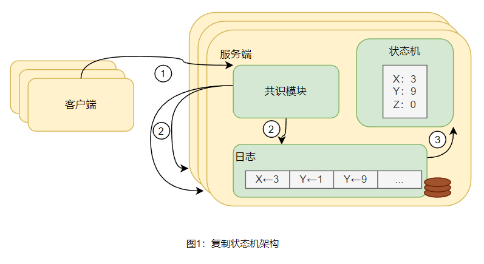
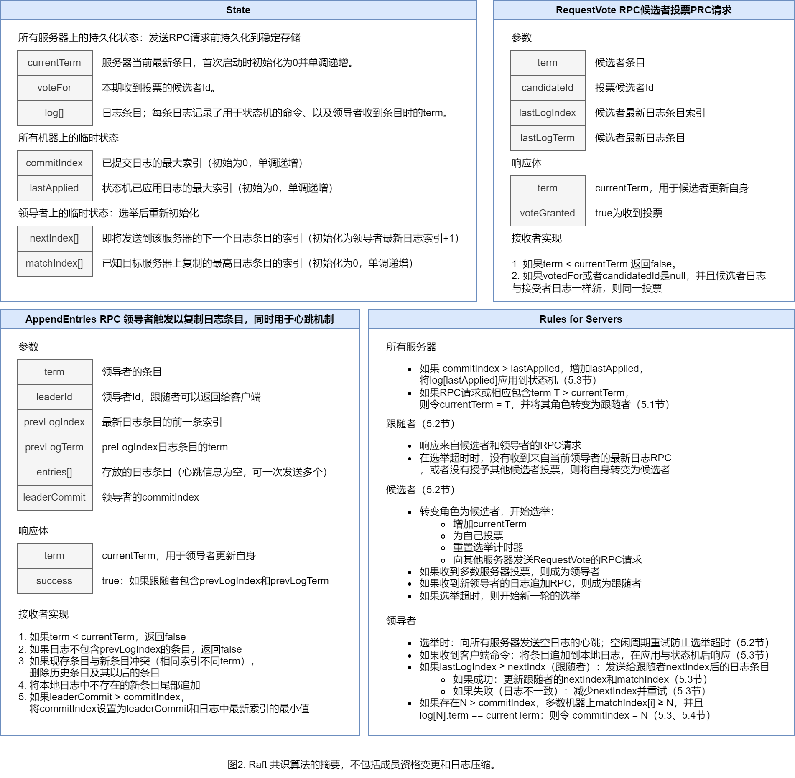
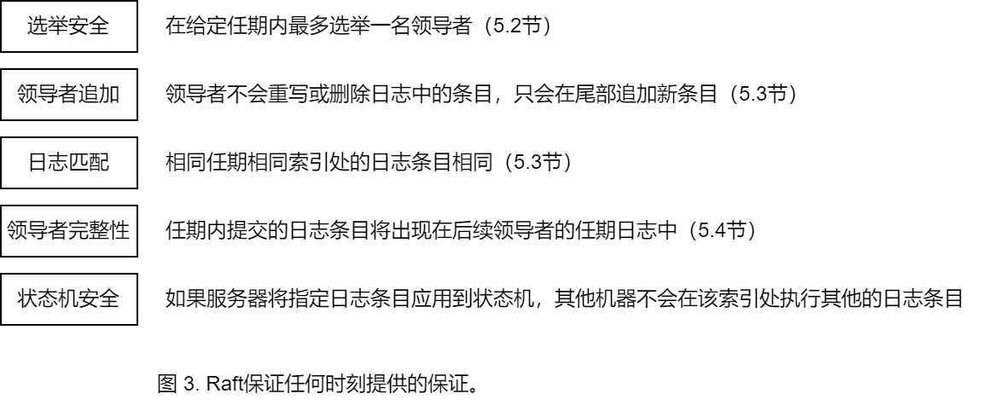
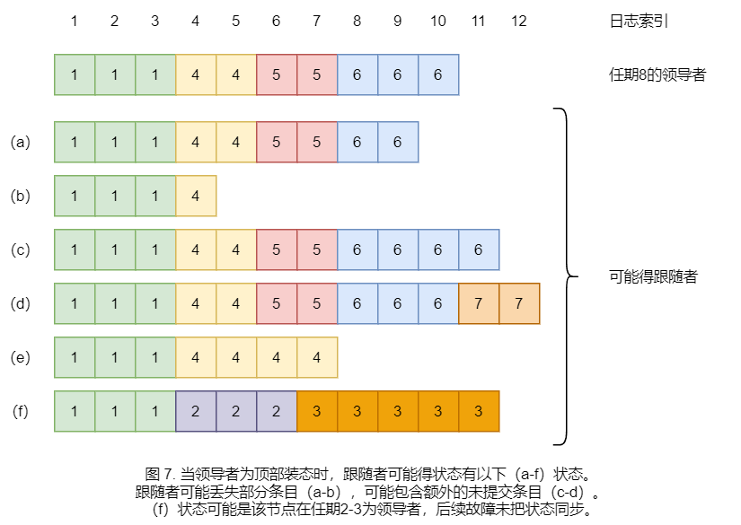

# raft

​	Raft是一个管理复制日志的共识算法。Raft的结果与经典共识算法Paxos一致，但Raft采用的结构与Paxos不同。Raft的结构更容易被理解，更易于构建实际应用。为了增强可理解性，Raft将共识要素分割成不同模块，有领导者选举、日志复制和安全。Raft采用强一致性保障，以减少需要考虑的状态数。研究结果表明Raft易于理解。Raft还提出来新的成员变更机制，以保证多数成员的安全。

1
# introduction

​	共识算法保障集群在部分机器故障时亦能正常工作。此类算法对于构建可靠的大规模软件系统至关重要。**Paxos** 是已被广泛讨论和使用经典共识算法。许多共识算法的实现都基于 Paxos 或受其影响。实际上，Paxos已成为向学生传授共识的主要方法。

​	然而**Paxos 难以理解和实现**，多次的简化尝试后但仍难以理解。 此外，Paxos的架构需要进行复杂的修改才能支持实际系统。使得系统构建者和学生都在使用 Paxos 时都存在困难。

​	因此需要创建一种比Paxos容易学习的算法，让系统构建者和学生更容易使用该算法。除了更易于学习外，清楚地了解该算法为何起作用对系统构建者至关重要。 通过提供对算法的直观理解，增强系统构建者有效使用和构建算法的能力。

​	本文提出了Raft共识算法。与Paxos等其他共识算法相比，Raft 通过分解和减少状态空间等特定技术来提高可理解性。分解例如领导者选举、日志复制和安全。对两所大学的43名学生的研究结果表明，Raft比Paxos更容易理解。在43名学生中，有33名能够更好地回答有关Raft的问题，而不是有关Paxos的问题。

​	Raft与现有共识算法有相似之处。但是，它还引入了一些新颖的功能：

- 强领导模式：在 Raft 中，日志条目只能从主服务器流向其他服务器，从而简化了对日志复制的管理，使 Raft 更易于理解。 
- 领导者选举：Raft 还使用**随机计时器**进行领导人选举。这种附加机制与共识算法所需的心跳相结合，有助于快速高效地解决冲突。
- ？成员变更管理？：Raft 在变更成员时使用**联合共识**方法，*<u>即在过渡期间，两种不同配置的大多数会重叠</u>*。这允许群集在配置更改期间继续正常运行。

​	无论是教育目的还是实际实现，Raft都优于Paxos和其他共识算法。 与其他算法相比，Raft 更简单、更易于理解，使学生和开发人员更容易学习和使用。 对Raft的描述足够详细，可以满足实际系统的需求，使其成为实施的合适基础。 Raft 有多个开源实现，并被多家公司使用，这表明其实际可行性。 Raft 的安全性能已得到正式规定和验证，确保了其可靠性。 Raft 的效率可与其他共识算法相媲美，使其成为实用系统的可行选择。

# 复制状态机

​	共识算法通常用于复制状态机的上下文。复制状态机涉及多台计算相同状态的相同副本的服务器。 即使某些服务器停机，状态机也可以继续运行。 复制状态机用于解决分布式系统中的容错问题。 例如，像 GFS、HDFS 和 RamCloud 这样的大型系统只有一个集群领导者，并使用副本状态机来管理领导者选举和存储配置信息。 复制状态机可确保配置信息在领导者崩溃后仍然存在。 复制状态机的示例包括 Chubby 和 ZooKeeper。

​	复制状态机通常使用复制日志来实现，如图1所示，这些日志顺序记录了操作命令。 每台服务器顺序执行日志中的命令，由于状态机是确定性的，相同的输入将始终产生相同的输出。 共识算法负责保持系统中所有服务器上复制的日志的一致性。

​	共识算法负责确保每台服务器的日志的一致性。 当客户端向服务器发送命令时，该服务器上的共识模块会将该命令添加到其日志中。 然后，共识模块将该命令复制到其他服务器中。 此复制过程可确保每台服务器的日志最终将以相同的顺序包含相同的命令。 正确复制命令后，每台服务器的状态机将按照日志中出现的顺序本地重放。 然后将状态机的输出返回给客户端。由于这个过程，服务器形成了一个单一的、高度可靠的状态机。

**使用复制的日志和共识算法的好处**

-使用复制的日志和共识算法，可以在多台服务器上创建高度可靠和一致的状态机。 -复制的日志确保每台服务器的状态机处理相同的命令序列，从而产生相同的状态和输出。 -共识算法可确保即使出现故障，复制的日志也能保持一致。 -这种方法为系统提供了容错能力和可靠性，因为即使某些服务器出现故障，状态机也可以继续运行。 -此外，使用复制的日志和共识算法简化了系统的实施和理解，使学生和研究人员更容易学习和使用。

​	用于实际系统的一致性算法通常具有以下特性：

- 保证在所有非拜占庭条件下的安全性(从不返回错误结果)，包括网络延迟、分区、分组丢失、复制和重新排序。
- 只要多数服务器正常（可以相互通信和与客户端通信），服务便可用。如五台服务器组成的集群可以承受任何两台服务器的故障。故障机器可通过存储的状态恢复并重新加入集群。
- 日志的一致性不依赖于时间：在最坏的情况下，错误的时钟和极端的消息延迟可能会导致可用性问题。
- 在常见情况下，只要大多数节点响应了RPC请求，命令就可以完成；少数速度较慢的服务器不会影响整体系统性能。（只要日志复制到大多数节点即认为变更生效）。

# Paxos的问题

​	在过去10年中，Paxos已经成为共识算法的标杆，其正确性已被各方认可。不幸的是，Paxos有两个重大的问题，其中之一是难以理解。对Paxos易理解性的工作集中在单一决策子集（single-decree subset）上，其分为两个阶段，但没有简单直观的解释，无法独立理解。Paxos的另一个问题是没有为构建实际应用提供良好的基础。其中一个原因是，目前还没有一个被广泛认可的multi-Paxos算法。Lamport的描述大多是关于单一决策的Paxos；他描述了实现multi-Paxos的可能方法，但许多细节都缺失了。许多关于Paxos的优化实现都彼此不同，也不同于Lamport的草图。如Chubby实现了类似Paxos的算法，但在大多数情况下，它们的细节还没有公布。

​	此外，Paxos架构对于构建实用系统来说是一个糟糕的架构；这是单一决策分解的另一个后果。例如，单独选择一组日志条目，然后将它们合并到一个顺序日志中只会增加复杂性。其中新条目以受约束的顺序追加会让日志系统更简单更高效。另一个问题是，Paxos在其核心使用了一种对称的点对点方法(尽管它最终提出了一种软弱的领导形式，以实现绩效优化)。这在简单决策（如单一命令的简化世界）中是有意义的，但很少有实际系统使用这种方法。而在系列决策中，先选举领导人，然后让领导人协调决策，会更简单、更快。

​	因此，实用的系统与Paxos几乎没有相似之处。从Paxos开始，在遇到困难后开发出一个显著不同的体系结构。这既耗时又容易出错，而且Paxos的难以理解加剧了问题。Paxos的公式可能是证明关于其正确性的定理的一个很好的公式，但真正的实现与Paxos是如此不同，以至于证明没有什么价值。来自Chubby实施者的以下评论是典型的：在对Paxos算法的描述与实际系统的需求之间有很大的差距...最终的系统将基于未经证实的协议实现。

​	综上，Paxos 并没有为系统构建或教育提供良好的基础。鉴于共识在大型软件系统中的重要性，我们决定看看是否可以设计一种比 Paxos 具有更好性能的替代共识算法。 Raft 因此诞生。

# 易理解的设计

​	设计Raft有几个目标：它必须为系统构建提供完整且实用的基础，从而大大减少开发人员的工作量；它必须在所有条件下都是安全的，并且在经典操作下可用；并且对于常见的操作必须是高效的。但我们最重要的目标——也是最困难的挑战——是可理解性。必须能够让大量受众轻松地理解该算法。此外，必须能够发展对算法的直觉，以便系统构建者可以进行现实世界实现中不可避免的扩展。

​	设计Raft有几个目标：为系统构建提供完整而实用的基础，减少开发人员的设计工作量；确保算法在所有条件下的安全性及其在典型操作条件下的可用性，并提高常见操作的效率；但是，最重要和最具挑战性的目标是让广大受众能够理解该算法；此外，设计人员希望系统构建者能透过直觉够理解算法的基本原理，并在实际实现中进行必要的扩展。

​	在Raft的设计过程中，设计师根据其可理解性对候选方案进行了评估。考虑了理解方案的有多难，如状态空间的复杂性及其可能产生的影响。此外，还评估了读者完全理解所选方法及其含义有多容易。设计人员优先考虑可理解性，以确保算法易于理解并可以向广大受众解释。

​	对共识算法的分析可能是主观的，因此使用了两种技术来使分析更加客观。第一种技术是**问题分解**，将复杂的问题分解成更小、更易于管理的部分。以 Raft 为例，将共识问题分领导者选举、日志复制、安全和成员变更。以此独立地求解、解释和理解每个组件，这使得整个算法更容易理解。

​	第二种方法是**简化算法的状态空间**（系统在任何给定时间可能处于的所有状态）。通过减少需要考虑的状态数量，消除了不必要的复杂性，使系统更加协调一致。例如，在 Raft 中，日志不允许有间隙，并限制了可能导致日志不一致的行为。状态空间的简化使算法更容易推理，并减少了出现意外行为的几率。此外，在大多数情况下，不确定性使算法更难理解。但是，在某些情况下，引入一定程度的不确定性实际上可以提高可理解性。其中一种情况是 Raft 领导者选举算法，随机化引入了不确定性，但它通过以类似的方式处理所有可能的选择来缩小状态空间，从而更容易推理算法。

# Raft算法

​	Raft 是一种旨在管理复制日志的算法，该日志记录需要在多个服务器上复制的事件或操作。本文第 2 节描述了该算法，图 2 提供了算法的简要摘要，便于参考。图 3 列出了算法的关键属性，本节的其余部分将详细讨论这些内容。

​	Raft 通过选举领导者来实现共识，领导者负责管理复制日志。领导者从客户端接收日志条目，将其复制到其他服务器上，并在日志条目应用到其状态机时ACK。领导者可以简化复制日志的管理，因为领导者可以在不咨询其他服务器的情况下决定在哪里放置新条目。数据以直接的方式从领导者流向其他服务器。但是，领导者可能会失败或与其他服务器断开连接，在这种情况下，需要选出新的领导者。

​	Raft 将共识问题分解为三个相对独立的子问题：领导者选举、日志复制和安全：

-   领导人选举涉及在现有领导人失败时选择新的领导人。

-   日志复制是领导者接受日志条目并将其复制到其他服务器的过程。

-   Raft 中的安全属性是共识算法的关键方面，可确保复制日志的完整性和一致性。如图 3 所示，一旦服务器执行了来自特定日志条目的命令，则禁止任何其他服务器对该日志条目执行不同的命令。本文的第5.4节描述了Raft如何确保状态机器安全属性。保障这种安全属性的解决方案涉及对选举机制的额外限制，将在5.2节进行解释。

​	在介绍共识算法之后，剩余部分将深入探讨了可用性问题以及计时在 Raft 系统中的作用。

## Raft基础

​	Raft 集群由多台服务器组成，通常是五台机器。此时，系统在不影响其功能的情况下容忍最多两台机器故障。集群中的有三种角色：领导者、跟随者或候选者。在正常操作中，只有一个领导者，所有其他服务器作为跟随者。跟随者是被动的，不会自己发起任何请求，只是响应领导者和候选者的请求。领导者负责处理所有客户请求。如果客户请求跟随者，请求会被重定向到领导者。如本文第5.2节所述，候选者用于选举新的领导者。图 4 说明了不同的服务器状态及其转换。

​	Raft 将任期划分为任意长度，如本文图 5 所示。为每个任期分配一个连续的整数。如本文第5.2节所述，每个任期都以选举开始，过程中一名或多名候选者试图成为领导者。如果候选者赢得选举，它将担任整个任期的领导者。在某些情况下，选举可能会因分裂投票没有选出领导者。在这种情况下，任期结束时没有领导者，将快速再次选举以开始新的任期。Raft保证任何任期内之多有一个领导者。

​	不同的服务器可能会在不同的时间观察到的转换。这意味着部分节点可能不感知选举过程甚至是整个任期。Raft 中的任期充当逻辑时钟，类似于时间戳，以此检测过时信息，例如过时的领导信息。Raft 中的每台服务器都存储当前任期编号，该数字会随着时间的推移单调增加。服务器相互通信时，都会交换当前的任期编号。如果一台服务器的当前任期小于另一台服务器的当前任期，则它会将其当前任期更新为更大的值。这可确保所有服务器最终具有相同的当前任期号。如果 Raft 中的候选者或领导者发现其任期已过期，这意味着另一台服务器的任期数更大，它将立即切换到跟随者状态。以确保只有具有最新任期编号的服务器才能成为领导者。如果服务器收到带有过时任期号的请求，会拒绝该请求，以防止处理过时或无效的请求。

​	Raft 服务器使用远程过程调用 (RPC) 相互通信。Raft 中需要两种类型的 RPC：RequestVote RPC 和 AppenDentries RPC。RequestVote RPC 由候选者在选举期间发起。候选者向其他服务器发送 RequestVote RPC 以请求他们的投票以成为领导者。AppenDentries RPC 由领导者发起，用于复制日志条目并提供某种形式的心跳。在本文的第7节中，介绍了用于在服务器之间传输快照的第三个RPC。快照是压缩日志并减小其大小的一种方法。Raft 中的服务器如果没有及时收到响应，则重试 RPC。服务器还会并行发出 RPC 以获得最佳性能。

## 领导者选举	

​	Raft 使用心跳机制触发领导人选举。服务器以跟随者身份启动，只要收到来自领导者或候选候的有效 RPC就会保持这种状态。领导者定期向所有关注者发送心跳（不携带任何日志条目的AppenDentries RPC）以维护他们的权威。如果关注者在选举时间内没有收到任何通信，会假设没有选出领导者，并开始新一轮选。

​	要开始选举，追随者延长当前任期并切换为候选者。然后，候选者为自己投票，并与集群中的其他服务器同时发出 RequestVote RPC。候选者将一直处于这种状态，直到以下三种情况之一发生： 自己赢得了选举；其他服务器成为领导者；超时没有选出领导者。

​	如果候选者获得整个集群中大多数服务器在同一任期内的选票，则该候选者将赢得选举。服务器在给定任期内最多可以投票给一名候选人，先到先得。多数规则确保在特定任期内最多有一名候选人能够赢得选举（选举安全）。一旦候选者赢得选举，它就会成为领导人。然后，领导者向所有其他服务器发送心跳消息，以周知状态并阻止新的选举。	

​	在等待投票时，候选者可能会收到来自另一台自称领导者的 AppenDentries RPC请求。如果请求中领导者的任期不晚于候选者的当前任期，则候选者承认该领导者的合法性并回到跟随者状态。如果RPC中的任期小于候选者的当前任期，则候选者拒绝RPC并保持候选者状态。

​	第三种可能的结果是，候选者既没有赢得也没有输掉选举。如果许多跟随者同时成为候选者，可能导致投票分裂没有候选人获得多数票。在这种情况下，每位候选者都将超时并通过延长任期并启动新一轮的选举。但是，如果不采取额外措施，分歧投票可能会无限期地重复。

​	Raft 使用**随机选举超时**来确保分歧投票很少出现并能迅速得到解决。首先，为了避免分散投票，选举超时是在固定间隔（例如 150-300 毫秒）内随机选择的。请求打散后，多数情况下，只有一台服务器会超时并赢得选举（超时重发投票请求），在其他服务器超时之前发送选举成功消息/心跳。同样的机制用于处理分割投票。每位候选者在选举开始时重新启动其随机选举超时时间，并等待超时时间过后再开始下一次选举。这减少了在新选举中再次出现分歧投票的可能性。本文第9.3节表明，这种方法可以快速选出领导者。

​	领导者选举是Raft为可理解性做出努力的一个示例。最初，作者计划使用排名系统，为每位候选者分配一个独特的排名。 在领导者选举期间，该排名系统将用于候选者之间的选择。 如果候选者发现另一位排名较高的候选人，它将返回到追随者，让排名较高的候选人更容易地在下次选举中获胜。 但是，这种方法会产生与可用性相关的问题。 例如，如果排名较高的服务器出现故障，则排名较低的服务器可能需要超时并再次成为候选者。 如果排名较低的服务器超时并过早成为候选者，它可能会重启选举领导者的进度。 解决这些问题时对算法进行了多次调整，但是每次调整都会出现新的极端情况。 最终，作者得出结论，随机重试方法更明显，更容易理解。 

## 日志复制

​	在选出领导者后，它将开始为客户请求提供服务。每个客户端请求都包含一条需要由复制状态机执行的命令。领导者将命令作为新条目添加到其日志中。添加后，领导者向其他服务器并行发送 AppenDentries RPC 以复制该日志条目。领导者在将日志应用到状态机后会响应客户端成功。如果跟随者故障、运行缓慢或网络数据包丢失，即便已响应客户端请求成功，领导者也会重试 AppenDentries RPC 以确保所有日志条目都被复制。

​	Raft 中的日志按如图6格式组织。每个日志条目都存储一条状态机命令以及领导者收到条目时的任期编号。日志条目中的任期数字用于检测日志之间的不一致性并保证图3中的特性。每个日志条目还有一个整数索引，用于标识其在日志中的位置。

​	领导者决定何时可以安全地将日志条目应用到状态机。当创建日志条目的领导者已将该条目复制到大多数服务器上时，该条目被视为已提交。提交日志条目后，可以保证其持久性，最终将被所有可用的状态机执行。提交日志条目还会提交领导者日志中的所有先前条目，包括前任领导创建的条目。领导者会跟踪其已知提交的最高索引，并将该索引包含在未来的 AppenDentRyes RPC 中，包括心跳，以便其他服务器最终发现该索引。一旦跟随者收到已提交的日志条目，就会按照日志中指定的顺序应用到其本地状态机。

	

​	Raft 共识算法旨在保持不同服务器上的日志之间的高度一致性。不仅简化了系统行为使其更易预测，对于确保系统的安全也非常重要，它有助于防止日志中的不一致和冲突。Raft 通过以下两个图3中的特性保证一致性：

- 如果不同日志中的两个条目处于相同的索引和任期，则它们存储相同的命令。
- 如果不同日志中的两个条目处于相同的索引和任期，则前面所有条目的日志都是相同的。

​	之所以实现日志匹配属性的第一个特性，是因为 Raft 算法中的领导者在指定任期中最多创建一个具有指定日志索引的条目。领导者不会使用相同的索引和任期创建多个条目，从而确保不同日志中具有相同索引和任期的条目将存储相同的命令。第二个特性由领导者在向跟随者发送 AppenDentries RPC 时执行的一致性检查来保证。领导者将条目的索引和任期包含在其日志中，该日志位于新条目之前。跟随者检查自己的日志，如果未找到具有相同索引和任期的条目，则拒绝新条目。此一致性检查充当归纳步骤，确保日志的初始空状态满足日志匹配属性，并且无论何时扩展日志，一致性检查都会保留日志匹配特性。因此，每当 AppendEentries RPC 成功返回时，领导者就会知道关注者的日志与自己通过新条目登录的日志相同。

​	在正常操作期间，领导者和关注者的日志保持一致，因此 AppendEentries 一致性检查永远不会失败。在使用Raft共识算法的分布式系统中，有一个领导者和多个跟随者。但是，领导者崩溃可能会使日志不一致（旧领导可能尚未完全复制其日志中的所有条目）。因为在崩溃之前，旧领导者可能没有足够的时间将所有日志完全复制给跟随者。结果，新领导者和跟随者的日志可能会变得不一致。这些不一致之处可能会在一系列的领导者和追随者崩溃中变得更加复杂。如果有多个领导者和追随者连续崩溃，则日志中的不一致性可能会变得更加严重。跟随者的日志中缺失和多余的日志条目可能跨越多个任期，因此解决起来更加复杂。

​	在 Raft 中，领导者负责处理跟随者日志中的不一致之处。领导者通过强制跟随者复制自己的日志来实现这一点。这意味着，如果跟随者的日志中有冲突的条目，则这些条目将被领导者日志中的条目所覆盖。为了使跟随者的日志与领导者的日志保持一致，领导者需要找到两者一致的最新日志条目（跳过不一致条目）。一旦领导确定了这个共识点，它就会删除跟随者该点之后出现的所有条目。然后，领导者将自己在那之后出现的所有日志发送给跟随者。所有这些操作均由 AppendEntries RPC 执行的一致性检查触发。领导者记录每个跟随者的 nextIndex 值，该值代表将发送给该跟随者的下一个日志条目的索引。当领导者首次上台时，它会用自己的下一个日志条目索引将所有 nextIndex 值初始化。如果跟随者的日志与领导者的日志不一致，则下一个 AppendEntries RPC 中的一致性检查将失败。作为对这种拒绝的回应，领导者将调低该跟随者的 nextIndex 值并重试 appenDentries RPC。此过程一直持续到 nextIndex 值达到领导者和跟随者日志匹配的点为止。领导者和关注者日志匹配后，AppendEntries RPC 将成功。成功的 AppendEntries RPC 会删除跟随者日志中的所有冲突条目，并从领导者的日志中追加条目（如果有）。成功执行 AppendEntries RPC 后，跟随者的日志将与领导者的日志保持一致，并将在剩余的任期内保持这种状态。

​	如果需要可以对协议进行优化，以减少被拒绝的 AppendEntries RPC 的数量。例如，当跟随者拒绝 AppendEntries 请求时，它可以在返回体中包含冲突条目的任期及其需要存储的第一个索引。有了这些信息，领导者可以减少 nextIndex 来绕过该任期中所有冲突的条目。这意味着，与其为每个条目发送一个 RPC，不如为每个条目有冲突的任期仅发送一个 AppendEntries RPC。但是，实际上，这种优化可能不是必需的，因为故障很少发生，而且不太可能出现许多不一致的条目。

​	有了这种机制，领导者在掌权时无需采取任何特殊措施来恢复日志一致性。领导者只需开始正常操作，日志就会在 AppendEntries 一致性检查失败过程中自动聚合。这意味着领导者不会覆盖或删除其自己的日志中的条目，从而确保了图3中的 “仅限领导者追加” 特性。

​	Raft 中的日志复制机制表现出第 2 节中描述的理想的共识算法特性。只要大多数服务器处于运行状态，Raft 就可以接收、复制和应用新的日志条目。在正常情况下，可以使用一轮 RPC 将新条目复制到集群的大部分区域。即使有一个跟随者很慢，也不会影响系统的性能。

## 安全

**Raft 算法中的一致性问题**

​	前几节描述了Raft如何选举领导者和复制日志条目。但是，仅靠这些机制不足以确保每个状态机以相同的顺序执行相同的命令。当跟随者（不是领导者的服务器）在领导者提交多个日志条目时变得不可用时，就会出现此问题。如果该跟随者随后被选为新的领导者，它可以用新的条目覆盖先前提交的条目。结果，不同的状态机可能会执行不同的命令序列，从而导致不一致。
​	为了解决这个问题，本文的这一部分增加了当选领导者的限制。以确保任何任期的领导者包含之前任期中提交的所有条目。该特性被称为领导者完整性。本文还提供了领导者完整性的证明草图，演示了它如何导致复制状态机的正确行为。该证明确立了 Raft 算法在确保所有状态机以相同顺序执行相同命令方面的可靠性和一致性。

### 选举限制

### 日志条目提交

### 安全参数

## 跟随者及候选者失败

## 时效及可用性

# 成员管理

# 日志压缩

# 客户端交互

